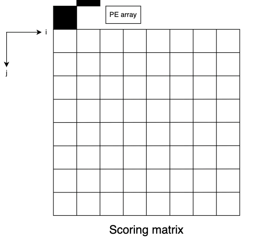

# Smith_Waterman_Genome_Alignment
This repo implements both software and hardware version of Smith Waterman algorithm  
## What is SW algorithm  
> The Smith–Waterman algorithm performs local sequence alignment; that is, for determining similar regions between two strings of nucleic acid sequences or protein sequences. Instead of looking at the entire sequence, the Smith–Waterman algorithm compares segments of all possible lengths and optimizes the similarity measure.
> please check out wiki for more information: https://en.wikipedia.org/wiki/Smith%E2%80%93Waterman_algorithm
### software
* run SW.py
* check out the result between two sequences both with 256 genomes
### hardware
* results after synthesis are too large to be uploaded
* you can only check RTL design
  > source license.sh
  > vcs tb_SW.v +define+SW+RTL -full64 -R -debug_access+all +v2k +notimingcheck
  > vcs tb_SW.v +define+SW_v2+RTL -full64 -R -debug_access+all +v2k +notimingcheck
* there are two designs in this repo
  1. simply use 256 PEs for alignment of two sequences both with 256 genomes
  2. use 128 PEs with a buffer
### PE design

### SW_v2 design

